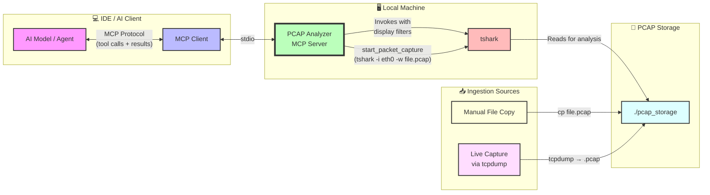
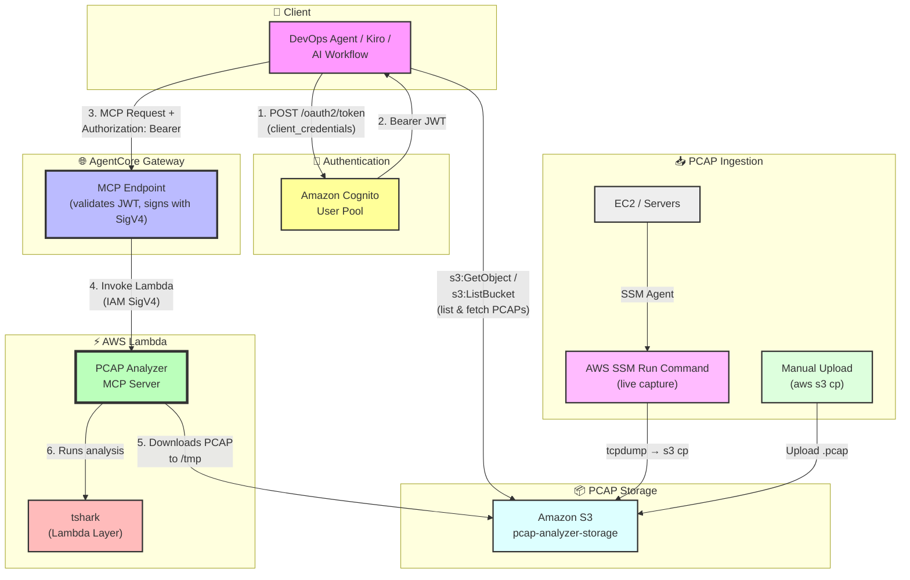
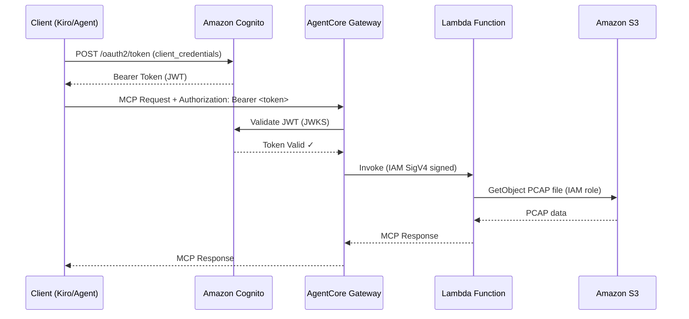

# PCAP Analyzer MCP Server

<div align="center">

[](https://pypi.org/project/awslabs.pcap-analyzer-mcp-server/)
[](https://pypi.org/project/awslabs.pcap-analyzer-mcp-server/)
[](https://www.python.org/downloads/)
[](LICENSE)
[](https://github.com/aws-samples/sample-pcap-analyzer-mcp/stargazers)

**An MCP server that gives AI agents deep network analysis capabilities using Wireshark/tshark.**

46 tools • 11 categories • Live capture + offline analysis • TCP/TLS/QUIC/BGP/DNS

[Quick Start](#-quick-start) •
[Installation](#-installation-methods) •
[Tools](#-tools-46-total) •
[Architecture](#architecture) •
[Examples](#-usage-examples)

</div>

---

## ⚡ Quick Start

```bash
# Install (requires uv and tshark)
uvx awslabs.pcap-analyzer-mcp-server@latest
```

Add to any MCP client config:

```json
{
  "mcpServers": {
    "pcap-analyzer": {
      "command": "uvx",
      "args": ["awslabs.pcap-analyzer-mcp-server@latest"]
    }
  }
}
```

Then ask your AI agent:
> *"Analyze traffic.pcap and identify why connections are failing"*

---

## Overview

This MCP server bridges AI models and Wireshark/tshark, enabling sophisticated packet capture and network analysis through natural language. It covers the full spectrum of network troubleshooting: from live capture to protocol analysis, security assessment, and performance diagnostics.

### Architecture

Two deployment patterns are supported:

#### Architecture 1: Local — IDE + MCP Server + tshark

Run the server locally alongside your IDE (Claude Desktop, VS Code, Cursor, Kiro, Amazon Q Developer). The AI model issues MCP tool calls, the server translates them into tshark commands, and returns structured results.



**Data flow:**
1. AI agent calls a tool (e.g., `analyze_tcp_retransmissions`)
2. MCP client sends JSON-RPC request over stdio to the server
3. Server constructs and runs appropriate `tshark` command with display filters
4. tshark reads the PCAP file from `./pcap_storage`, applies filters, outputs structured data
5. Server parses tshark output and returns results to the AI model

For live capture, the server spawns `tshark -i <interface> -w <output.pcap>` which writes directly to the storage directory.

#### Architecture 2: Cloud — AgentCore Gateway + Lambda

For team-wide or production deployments. A DevOps agent (or any OAuth2 client) calls the MCP server through Amazon Bedrock AgentCore Gateway. Inbound auth is handled by Cognito (JWT), outbound auth by IAM (SigV4). The DevOps Agent also has direct S3 read access (`s3:GetObject`, `s3:ListBucket`) to list and fetch PCAPs.



**Data flow:**
1. Client authenticates with Cognito, receives JWT
2. Client can list/fetch PCAPs from S3 directly (`s3:GetObject`, `s3:ListBucket`)
3. Client sends MCP request to AgentCore Gateway with Bearer token
4. Gateway validates JWT, then invokes Lambda using IAM SigV4
5. Lambda downloads the PCAP from S3 to `/tmp`, then invokes tshark for analysis
6. Server returns MCP response through the gateway

### Key Capabilities

| Category | What it does |
|----------|-------------|
| 🔧 Capture | Live packet capture, interface discovery, session management |
| 📊 Protocol Analysis | TCP, TLS, QUIC/HTTP3, BGP, DNS, HTTP deep inspection |
| 🔒 Security | TLS handshakes, PQC detection, ARP spoofing, DNS tunneling, credential exposure |
| ⚡ Performance | Latency, throughput, bandwidth, connection reuse, quality metrics |
| 🔍 Diagnostics | MTU/fragmentation, connection timeouts, out-of-order packets, duplicate ACKs |
| 🌐 Intelligence | Geo/ASN mapping, ICMP error classification, TCP reset analysis |

---

## Prerequisites

- **Python 3.10+**
- **uv** — [Install uv](https://docs.astral.sh/uv/getting-started/installation/)
- **Wireshark/tshark**:

  ```bash
  # macOS
  brew install wireshark

  # Ubuntu/Debian
  sudo apt-get install tshark

  # Windows — download from wireshark.org
  ```

### Packet Capture Permissions

| Platform | Command |
|----------|---------|
| **macOS** | `sudo dseditgroup -o edit -a $(whoami) -t user access_bpf` (restart required) |
| **Linux** | `sudo setcap cap_net_raw,cap_net_admin=eip /usr/bin/dumpcap` |
| **Windows** | Run as Administrator with Npcap installed |

---

## 📦 Installation Methods

### Option 1: One-Click Install

| Cursor | VS Code |
|:------:|:-------:|
| [](https://cursor.com/en/install-mcp?name=awslabs.pcap-analyzer-mcp-server&config=eyJjb21tYW5kIjoidXZ4IiwiYXJncyI6WyJhd3NsYWJzLnBjYXAtYW5hbHl6ZXItbWNwLXNlcnZlckBsYXRlc3QiXX0=) | [](https://insiders.vscode.dev/redirect/mcp/install?name=PCAP%20Analyzer%20MCP%20Server&config=%7B%22command%22%3A%22uvx%22%2C%22args%22%3A%5B%22awslabs.pcap-analyzer-mcp-server%40latest%22%5D%7D) |

### Option 2: Kiro

Add to `.kiro/settings/mcp.json`:

```json
{
  "mcpServers": {
    "pcap-analyzer": {
      "command": "uvx",
      "args": ["awslabs.pcap-analyzer-mcp-server@latest"]
    }
  }
}
```

Visit [kiro.amazon.dev](https://kiro.amazon.dev) for more information.

### Option 3: AgentCore Gateway + Lambda (Cloud Deployment)

For team-wide or production deployments with full OAuth2/Cognito inbound auth and IAM outbound auth.

<details>
<summary><b>📋 Click to expand full deployment guide (8 steps)</b></summary>

#### Prerequisites
- AWS account with Lambda, Amazon Cognito, and AgentCore Gateway access
- AWS credentials configured (`aws configure` or environment variables)

#### Step 1: Create the Lambda Execution Role (IAM)

```bash
cat > lambda-trust-policy.json << 'EOF'
{
  "Version": "2012-10-17",
  "Statement": [
    {
      "Effect": "Allow",
      "Principal": { "Service": "lambda.amazonaws.com" },
      "Action": "sts:AssumeRole"
    }
  ]
}
EOF

aws iam create-role \
  --role-name pcap-analyzer-lambda-role \
  --assume-role-policy-document file://lambda-trust-policy.json

aws iam attach-role-policy \
  --role-name pcap-analyzer-lambda-role \
  --policy-arn arn:aws:iam::aws:policy/service-role/AWSLambdaBasicExecutionRole

aws iam attach-role-policy \
  --role-name pcap-analyzer-lambda-role \
  --policy-arn arn:aws:iam::aws:policy/AmazonS3FullAccess
```

#### Step 2: Create the Lambda Function

```bash
zip -r pcap-analyzer-lambda.zip awslabs/ pyproject.toml

aws lambda create-function \
  --function-name pcap-analyzer-mcp-server \
  --runtime python3.10 \
  --role arn:aws:iam::YOUR_ACCOUNT_ID:role/pcap-analyzer-lambda-role \
  --handler awslabs.pcap_analyzer_mcp_server.server.lambda_handler \
  --zip-file fileb://pcap-analyzer-lambda.zip \
  --timeout 300 \
  --memory-size 1024 \
  --environment Variables="{PCAP_STORAGE_DIR=/tmp/pcap_storage,WIRESHARK_PATH=/opt/bin/tshark}"
```

> **Note**: For Lambda deployments, set the `WIRESHARK_PATH` environment variable to `/opt/bin/tshark` (the path where your Lambda layer installs tshark).

#### Step 3: Deploy tshark Layer

```bash
mkdir -p layer/bin
cp /path/to/static-tshark layer/bin/tshark
chmod +x layer/bin/tshark
cd layer && zip -r ../tshark-layer.zip . && cd ..

aws lambda publish-layer-version \
  --layer-name tshark-layer \
  --zip-file fileb://tshark-layer.zip \
  --compatible-runtimes python3.10 python3.11

aws lambda update-function-configuration \
  --function-name pcap-analyzer-mcp-server \
  --layers arn:aws:lambda:REGION:YOUR_ACCOUNT_ID:layer:tshark-layer:1
```

#### Step 4: Configure Inbound Authorization (OAuth2 via Amazon Cognito)

```bash
# Create User Pool
aws cognito-idp create-user-pool \
  --pool-name pcap-analyzer-user-pool \
  --policies '{"PasswordPolicy":{"MinimumLength":8,"RequireUppercase":true,"RequireLowercase":true,"RequireNumbers":true}}' \
  --auto-verified-attributes email \
  --region us-east-1

# Create Resource Server
aws cognito-idp create-resource-server \
  --user-pool-id us-east-1_XXXXXXXXX \
  --identifier https://pcap-analyzer.example.com \
  --name "PCAP Analyzer MCP Server" \
  --scopes ScopeName=read,ScopeDescription="Read access" \
            ScopeName=write,ScopeDescription="Write/capture access" \
  --region us-east-1

# Create App Client
aws cognito-idp create-user-pool-client \
  --user-pool-id us-east-1_XXXXXXXXX \
  --client-name pcap-analyzer-gateway-client \
  --allowed-o-auth-flows client_credentials \
  --allowed-o-auth-scopes pcap-analyzer/read pcap-analyzer/write \
  --generate-secret \
  --region us-east-1

# Configure Domain
aws cognito-idp create-user-pool-domain \
  --domain pcap-analyzer-auth \
  --user-pool-id us-east-1_XXXXXXXXX \
  --region us-east-1
```

#### Step 5: Configure Outbound Authorization (IAM)

```bash
cat > pcap-analyzer-outbound-policy.json << 'EOF'
{
  "Version": "2012-10-17",
  "Statement": [
    {
      "Sid": "AllowS3PcapStorage",
      "Effect": "Allow",
      "Action": ["s3:PutObject", "s3:GetObject", "s3:ListBucket", "s3:DeleteObject"],
      "Resource": [
        "arn:aws:s3:::pcap-analyzer-storage-YOUR_ACCOUNT_ID",
        "arn:aws:s3:::pcap-analyzer-storage-YOUR_ACCOUNT_ID/*"
      ]
    },
    {
      "Sid": "AllowCloudWatchLogs",
      "Effect": "Allow",
      "Action": ["logs:CreateLogGroup", "logs:CreateLogStream", "logs:PutLogEvents"],
      "Resource": "arn:aws:logs:*:YOUR_ACCOUNT_ID:log-group:/aws/lambda/pcap-analyzer-*"
    }
  ]
}
EOF

aws iam create-policy \
  --policy-name pcap-analyzer-outbound-policy \
  --policy-document file://pcap-analyzer-outbound-policy.json

aws iam attach-role-policy \
  --role-name pcap-analyzer-lambda-role \
  --policy-arn arn:aws:iam::YOUR_ACCOUNT_ID:policy/pcap-analyzer-outbound-policy
```

#### Step 6: Authorization Flow



#### Step 7: PCAP Ingestion

**Manual Upload:**
```bash
aws s3 mb s3://pcap-analyzer-storage-YOUR_ACCOUNT_ID --region us-east-1
aws s3 cp capture.pcap s3://pcap-analyzer-storage-YOUR_ACCOUNT_ID/captures/
```

**Active Capture via SSM (no SSH required):**
```bash
aws ssm send-command \
  --instance-ids "i-XXXXXXXXXXXXXXXXX" \
  --document-name "AWS-RunShellScript" \
  --parameters '{"commands":[
    "CAPTURE_FILE=/tmp/capture-$(date +%Y%m%d-%H%M%S).pcap",
    "timeout 60 tcpdump -i any -w $CAPTURE_FILE -s 0 2>/dev/null || true",
    "aws s3 cp $CAPTURE_FILE s3://pcap-analyzer-storage-YOUR_ACCOUNT_ID/captures/",
    "rm -f $CAPTURE_FILE"
  ]}' \
  --region us-east-1
```

#### Step 8: Test the Integration

```bash
TOKEN=$(curl -s -X POST \
  https://pcap-analyzer-auth.auth.us-east-1.amazoncognito.com/oauth2/token \
  -H "Content-Type: application/x-www-form-urlencoded" \
  -d "grant_type=client_credentials&client_id=YOUR_CLIENT_ID&client_secret=YOUR_SECRET&scope=pcap-analyzer/read" \
  | jq -r '.access_token')

curl -X POST https://YOUR_AGENTCORE_ENDPOINT/mcp \
  -H "Authorization: Bearer $TOKEN" \
  -H "Content-Type: application/json" \
  -d '{"jsonrpc":"2.0","method":"tools/list","params":{},"id":1}'
```

#### Lambda Considerations

| Consideration | Details |
|--------------|---------|
| **Storage** | 512MB `/tmp` — suitable for analysis, not large captures |
| **Timeout** | Max 900s; recommend 300s default |
| **Memory** | 1024MB+ for large PCAP files |
| **Capture** | Live capture not supported (analysis only) |
| **tshark** | Must be provided via Lambda layer |
| **Cold Start** | Use Provisioned Concurrency for latency-sensitive use |

</details>

### Option 4: Manual Installation

```bash
# Using uvx (recommended)
uvx awslabs.pcap-analyzer-mcp-server@latest

# Using pip
pip install awslabs.pcap-analyzer-mcp-server
awslabs.pcap-analyzer-mcp-server

# From source
git clone https://github.com/aws-samples/sample-pcap-analyzer-mcp.git
cd sample-pcap-analyzer-mcp
uv sync
uv run awslabs.pcap-analyzer-mcp-server
```

---

## Configuration

### Claude Desktop

**macOS**: `~/Library/Application Support/Claude/claude_desktop_config.json`

```json
{
  "mcpServers": {
    "pcap-analyzer": {
      "command": "uvx",
      "args": ["awslabs.pcap-analyzer-mcp-server@latest"]
    }
  }
}
```

**Windows**: `%APPDATA%\Claude\claude_desktop_config.json`

```json
{
  "mcpServers": {
    "pcap-analyzer": {
      "command": "uvx",
      "args": ["awslabs.pcap-analyzer-mcp-server@latest"],
      "env": {
        "WIRESHARK_PATH": "C:\\Program Files\\Wireshark\\tshark.exe"
      }
    }
  }
}
```

### Amazon Q Developer

Edit `~/.aws/amazonq/mcp.json`:

```json
{
  "mcpServers": {
    "pcap-analyzer": {
      "command": "uvx",
      "args": ["awslabs.pcap-analyzer-mcp-server@latest"]
    }
  }
}
```

### Environment Variables

| Variable | Description | Default |
|----------|-------------|---------|
| `PCAP_STORAGE_DIR` | Directory for storing captured PCAP files | `./pcap_storage` |
| `MAX_CAPTURE_DURATION` | Maximum capture duration in seconds | `3600` |
| `WIRESHARK_PATH` | Path to tshark executable | `tshark` |

> **Security**: The server validates that the tshark path is a non-empty string and sanitizes all command arguments against shell injection characters (`;`, `&`, `|`, `` ` ``, `$`). Set the `WIRESHARK_PATH` environment variable to point to your tshark binary.

---

## 🔧 Tools (46 total)

<details>
<summary><b>Network Interface Management (1 tool)</b></summary>

- `list_network_interfaces` — Discover available network interfaces for capture
</details>

<details>
<summary><b>Packet Capture Management (4 tools)</b></summary>

- `start_packet_capture` — Start capture on specified interface
- `stop_packet_capture` — Stop an active capture session
- `get_capture_status` — Get status of all active sessions
- `list_captured_files` — List all captured PCAP files
</details>

<details>
<summary><b>Basic PCAP Analysis (4 tools)</b></summary>

- `analyze_pcap_file` — Generate comprehensive analysis
- `extract_http_requests` — Extract HTTP requests
- `generate_traffic_timeline` — Create temporal traffic analysis
- `search_packet_content` — Search for patterns in packet data
</details>

<details>
<summary><b>Network Performance (2 tools)</b></summary>

- `analyze_network_performance` — Performance metrics analysis
- `analyze_network_latency` — Latency and response time analysis
</details>

<details>
<summary><b>TLS/SSL Security (6 tools)</b></summary>

- `analyze_tls_handshakes` — TLS handshakes including PQC detection
- `analyze_sni_mismatches` — SNI mismatches correlated with resets
- `extract_certificate_details` — Certificate validation against SNI
- `analyze_tls_alerts` — TLS alert messages and handshake failures
- `analyze_connection_lifecycle` — Complete connection flow tracking
- `extract_tls_cipher_analysis` — Cipher suite and key exchange analysis
</details>

<details>
<summary><b>TCP Protocol Analysis (5 tools)</b></summary>

- `analyze_tcp_retransmissions` — Retransmissions and packet loss
- `analyze_tcp_zero_window` — Flow control issues
- `analyze_tcp_window_scaling` — Window scaling mechanisms
- `analyze_packet_timing_issues` — Timing and duplicate packets
- `analyze_congestion_indicators` — Congestion metrics
</details>

<details>
<summary><b>Advanced Network Analysis (5 tools)</b></summary>

- `analyze_dns_resolution_issues` — DNS resolution troubleshooting
- `analyze_expert_information` — Wireshark expert analysis
- `analyze_protocol_anomalies` — Protocol violations
- `analyze_network_topology` — Network structure mapping
- `analyze_security_threats` — Security threat identification
</details>

<details>
<summary><b>Performance & Quality Metrics (4 tools)</b></summary>

- `generate_throughput_io_graph` — Throughput visualization data
- `analyze_bandwidth_utilization` — Bandwidth usage patterns
- `analyze_application_response_times` — Application performance
- `analyze_network_quality_metrics` — Jitter and packet loss
</details>

<details>
<summary><b>Network Diagnostics (6 tools)</b></summary>

- `analyze_mtu_fragmentation` — MTU/PMTU discovery failures
- `analyze_tcp_resets` — RST analysis with context
- `analyze_duplicate_acks` — Duplicate ACKs vs. reordering
- `analyze_icmp_errors` — ICMP error classification
- `analyze_connection_timeouts` — SYN timeouts, idle timeouts, half-open
- `analyze_out_of_order_packets` — Path issue detection
</details>

<details>
<summary><b>Protocol & Stream Analysis (3 tools)</b></summary>

- `analyze_quic_traffic` — QUIC/HTTP3 connection analysis
- `follow_tcp_stream` — TCP stream reassembly
- `follow_udp_stream` — UDP stream reassembly
</details>

<details>
<summary><b>Security Detection (3 tools)</b></summary>

- `detect_arp_spoofing` — ARP spoofing detection
- `detect_dns_tunneling` — DNS tunneling, entropy analysis, beaconing
- `extract_credentials` — Plaintext credential detection (HTTP Basic, FTP, Telnet, SMTP)
</details>

<details>
<summary><b>Data Extraction & Intelligence (3 tools)</b></summary>

- `extract_fields` — Arbitrary tshark field extraction
- `analyze_connection_reuse` — HTTP connection pooling analysis
- `analyze_geo_asn_mapping` — IP to ASN/organization mapping
</details>

---

## 💡 Usage Examples

| Prompt | What happens |
|--------|-------------|
| *"Analyze bgp.pcap and explain why the BGP connection is failing"* | Examines BGP OPEN messages, AS numbers, connection lifecycle |
| *"Capture traffic on eth0 for 60 seconds and check for security threats"* | Live capture → security analysis |
| *"Examine TLS handshakes and identify certificate issues"* | SNI validation, cipher negotiation, PQC detection |
| *"Check for TCP retransmissions and connection quality"* | Loss patterns, congestion, window scaling |
| *"Give me a complete analysis of network-dump.pcap"* | Full protocol breakdown and anomaly detection |

---

## Troubleshooting

<details>
<summary><b>tshark not found</b></summary>

```bash
tshark --version    # Verify installation
brew install wireshark              # macOS
sudo apt-get install tshark         # Linux
```

If tshark is installed in a non-standard location, set the `WIRESHARK_PATH` environment variable to the full path of your tshark binary.
</details>

<details>
<summary><b>Permission denied during capture</b></summary>

- **macOS**: `sudo dseditgroup -o edit -a $(whoami) -t user access_bpf` (restart)
- **Linux**: `sudo setcap cap_net_raw,cap_net_admin=eip /usr/bin/dumpcap`
- **Windows**: Run as Administrator
</details>

<details>
<summary><b>PCAP file not found</b></summary>

- Use `list_captured_files` to see available files
- Try relative path (`bgp.pcap`) or absolute path
- Verify `.pcap` or `.pcapng` extension
</details>

<details>
<summary><b>Analysis returns empty results</b></summary>

- PCAP may not contain the target protocol
- Display filter may be too restrictive
- Start with `analyze_pcap_file` for a general overview
</details>

---

## Development

```bash
git clone https://github.com/aws-samples/sample-pcap-analyzer-mcp.git
cd sample-pcap-analyzer-mcp
uv sync
uv run awslabs.pcap-analyzer-mcp-server    # Run server
uv run pytest                               # Run tests
```

## Contributing

We welcome community contributions! See [CONTRIBUTING.md](CONTRIBUTING.md) for guidelines.

## License

This library is licensed under the MIT-0 License. See the [LICENSE](LICENSE) file.

---

<div align="center">
<sub>Built with ❤️ by AWS</sub>
</div>
