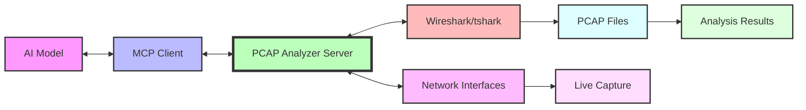

# PCAP Analyzer MCP Server

<div align="center">

[](https://github.com/awslabs/mcp)
[](https://pypi.org/project/awslabs.pcap-analyzer-mcp-server/)
[](LICENSE)

A Model Context Protocol (MCP) server for comprehensive network packet capture and analysis using Wireshark/tshark.

[Installation](#installation) •
[Configuration](#configuration) •
[Tools](#tools) •
[Examples](#usage-examples)

</div>

## Overview

This MCP server enables AI models to perform sophisticated network packet capture and analysis. It provides **31 specialized tools** across 8 categories for deep network analysis, troubleshooting, and security assessment.

### Architecture



### Key Capabilities

- 🔧 Network interface discovery and live packet capture
- 📊 Comprehensive protocol analysis (TCP, TLS, BGP, DNS, HTTP)
- 🔒 Security analysis (TLS handshakes, certificate validation, threat detection)
- ⚡ Performance metrics (latency, throughput, bandwidth, quality)
- 🔍 Protocol-specific troubleshooting and expert analysis

## Prerequisites

- **Python 3.10+**
- **uv** - [Install uv](https://docs.astral.sh/uv/getting-started/installation/)
- **Wireshark/tshark**:
  - macOS: `brew install wireshark`
  - Linux: `sudo apt-get install tshark`  
  - Windows: Download from [wireshark.org](https://www.wireshark.org/download.html)

### Packet Capture Permissions

| Platform | Command |
|----------|---------|
| **macOS** | `sudo dseditgroup -o edit -a $(whoami) -t user access_bpf` (restart required) |
| **Linux** | `sudo setcap cap_net_raw,cap_net_admin=eip /usr/bin/dumpcap` |
| **Windows** | Run as Administrator with Npcap installed |

## 📦 Installation Methods

### Option 1: One-Click Install (Cursor, VS Code)

| Cursor | VS Code |
|:------:|:-------:|
| [](https://cursor.com/en/install-mcp?name=awslabs.pcap-analyzer-mcp-server&config=eyJjb21tYW5kIjoidXZ4IiwiYXJncyI6WyJhd3NsYWJzLnBjYXAtYW5hbHl6ZXItbWNwLXNlcnZlckBsYXRlc3QiXX0=) | [](https://insiders.vscode.dev/redirect/mcp/install?name=PCAP%20Analyzer%20MCP%20Server&config=%7B%22command%22%3A%22uvx%22%2C%22args%22%3A%5B%22awslabs.pcap-analyzer-mcp-server%40latest%22%5D%7D) |

### Option 2: Kiro (Amazon Internal)

**For Kiro users**, add this server at the project level in `.kiro/settings/mcp.json`:

```json
{
  "mcpServers": {
    "pcap-analyzer": {
      "command": "uvx",
      "args": ["awslabs.pcap-analyzer-mcp-server@latest"]
    }
  }
}
```

Visit [kiro.amazon.dev](https://kiro.amazon.dev) for more information.

### Option 3: AgentCore Gateway with Lambda (Amazon Internal)

**For AgentCore users**, this server can be deployed as a Lambda function behind AgentCore Gateway.

#### Prerequisites
- AWS account with Lambda and AgentCore Gateway access
- Kiro configured for your project
- AWS credentials configured

#### Deployment Steps

1. **Create Lambda Function**:
```bash
# Package the server for Lambda
zip -r pcap-analyzer-lambda.zip awslabs/ pyproject.toml

# Create Lambda function
aws lambda create-function \
  --function-name pcap-analyzer-mcp-server \
  --runtime python3.10 \
  --role arn:aws:iam::ACCOUNT_ID:role/lambda-execution-role \
  --handler awslabs.pcap_analyzer_mcp_server.server.lambda_handler \
  --zip-file fileb://pcap-analyzer-lambda.zip \
  --timeout 300 \
  --memory-size 1024 \
  --environment Variables="{PCAP_STORAGE_DIR=/tmp/pcap_storage,WIRESHARK_PATH=/opt/bin/tshark}"
```

2. **Configure AgentCore Gateway**:

Add to your Kiro project's `.kiro/agentcore-gateway.json`:

```json
{
  "mcpServers": {
    "pcap-analyzer": {
      "type": "lambda",
      "functionName": "pcap-analyzer-mcp-server",
      "region": "us-east-1",
      "timeout": 300
    }
  }
}
```

3. **Deploy tshark Layer** (Required):

Since Lambda doesn't include tshark, you need to provide it:

```bash
# Create Lambda layer with tshark
mkdir -p layer/bin
# Download static tshark binary or compile for Amazon Linux 2023
cp /path/to/tshark layer/bin/

cd layer
zip -r ../tshark-layer.zip .
cd ..

# Create layer
aws lambda publish-layer-version \
  --layer-name tshark-layer \
  --zip-file fileb://tshark-layer.zip \
  --compatible-runtimes python3.10 python3.11

# Attach layer to function
aws lambda update-function-configuration \
  --function-name pcap-analyzer-mcp-server \
  --layers arn:aws:lambda:REGION:ACCOUNT:layer:tshark-layer:VERSION
```

4. **Test the Integration**:

In Kiro, the server will be automatically available through AgentCore Gateway:

```python
# Kiro will handle the routing
# Use the tools as normal through your AI agent
"Analyze bgp.pcap and explain the BGP connection failure"
```

#### Lambda Considerations

- **Storage**: Lambda has 512MB `/tmp` storage - suitable for analysis, limited for capture
- **Timeout**: Set appropriate timeout (max 900s) based on analysis complexity
- **Memory**: Recommend 1024MB+ for large PCAP files
- **Capture**: Live packet capture not supported in Lambda (analysis only)
- **tshark**: Must be provided via Lambda layer (not included in base runtime)

### Option 4: Manual Installation

```bash
# Using uvx (recommended)
uvx awslabs.pcap-analyzer-mcp-server@latest

# Using pip
pip install awslabs.pcap-analyzer-mcp-server
awslabs.pcap-analyzer-mcp-server

# From source
git clone https://github.com/awslabs/mcp.git
cd mcp/src/pcap-analyzer-mcp-server
uv sync
uv run awslabs.pcap-analyzer-mcp-server
```

## Configuration

### Claude Desktop

**macOS**: `~/Library/Application Support/Claude/claude_desktop_config.json`

```json
{
  "mcpServers": {
    "pcap-analyzer": {
      "command": "uvx",
      "args": ["awslabs.pcap-analyzer-mcp-server@latest"]
    }
  }
}
```

**Windows**: `%APPDATA%\Claude\claude_desktop_config.json`

```json
{
  "mcpServers": {
    "pcap-analyzer": {
      "command": "uvx",
      "args": ["awslabs.pcap-analyzer-mcp-server@latest"],
      "env": {
        "WIRESHARK_PATH": "C:\\Program Files\\Wireshark\\tshark.exe"
      }
    }
  }
}
```

### Amazon Q Developer

Edit `~/.aws/amazonq/mcp.json`:

```json
{
  "mcpServers": {
    "pcap-analyzer": {
      "command": "uvx",
      "args": ["awslabs.pcap-analyzer-mcp-server@latest"]
    }
  }
}
```

### Kiro

At the project level `.kiro/settings/mcp.json`:

```json
{
  "mcpServers": {
    "pcap-analyzer": {
      "command": "uvx",
      "args": ["awslabs.pcap-analyzer-mcp-server@latest"]
    }
  }
}
```

### Environment Variables

| Variable | Description | Default |
|----------|-------------|---------|
| `PCAP_STORAGE_DIR` | Directory for storing captured PCAP files | `./pcap_storage` |
| `MAX_CAPTURE_DURATION` | Maximum capture duration in seconds | `3600` |
| `WIRESHARK_PATH` | Path to tshark executable | `tshark` |

## Tools

This server provides 31 tools organized into 8 categories:

<details>
<summary><b>Network Interface Management (1 tool)</b></summary>

- `list_network_interfaces` - List available network interfaces for packet capture
</details>

<details>
<summary><b>Packet Capture Management (4 tools)</b></summary>

- `start_packet_capture` - Start packet capture on specified interface
- `stop_packet_capture` - Stop an active packet capture session
- `get_capture_status` - Get status of all active capture sessions
- `list_captured_files` - List all captured pcap files in storage directory
</details>

<details>
<summary><b>Basic PCAP Analysis (4 tools)</b></summary>

- `analyze_pcap_file` - Analyze a pcap file and generate insights
- `extract_http_requests` - Extract HTTP requests from pcap file
- `generate_traffic_timeline` - Generate traffic timeline with specified time intervals
- `search_packet_content` - Search for specific patterns in packet content
</details>

<details>
<summary><b>Network Performance Analysis (2 tools)</b></summary>

- `analyze_network_performance` - Analyze network performance metrics from pcap file
- `analyze_network_latency` - Analyze network latency and response times
</details>

<details>
<summary><b>TLS/SSL Security Analysis (6 tools)</b></summary>

- `analyze_tls_handshakes` - Analyze TLS handshakes including SNI, certificate details
- `analyze_sni_mismatches` - Analyze SNI mismatches and correlate with connection resets
- `extract_certificate_details` - Extract SSL certificate details and validate against SNI
- `analyze_tls_alerts` - Analyze TLS alert messages that indicate handshake failures
- `analyze_connection_lifecycle` - Analyze complete connection lifecycle from SYN to FIN/RST
- `extract_tls_cipher_analysis` - Analyze TLS cipher suite negotiations and compatibility issues
</details>

<details>
<summary><b>TCP Protocol Analysis (5 tools)</b></summary>

- `analyze_tcp_retransmissions` - Analyze TCP retransmissions and packet loss patterns
- `analyze_tcp_zero_window` - Analyze TCP zero window conditions and flow control issues
- `analyze_tcp_window_scaling` - Analyze TCP window scaling and flow control mechanisms
- `analyze_packet_timing_issues` - Analyze packet timing issues and duplicate packets
- `analyze_congestion_indicators` - Analyze network congestion indicators and quality metrics
</details>

<details>
<summary><b>Advanced Network Analysis (5 tools)</b></summary>

- `analyze_dns_resolution_issues` - Analyze DNS resolution issues and query patterns
- `analyze_expert_information` - Analyze Wireshark expert information for network issues
- `analyze_protocol_anomalies` - Analyze protocol anomalies and malformed packets
- `analyze_network_topology` - Analyze network topology and routing information
- `analyze_security_threats` - Analyze potential security threats and suspicious activities
</details>

<details>
<summary><b>Performance & Quality Metrics (4 tools)</b></summary>

- `generate_throughput_io_graph` - Generate throughput I/O graph data with specified time intervals
- `analyze_bandwidth_utilization` - Analyze bandwidth utilization and traffic patterns
- `analyze_application_response_times` - Analyze application layer response times and performance
- `analyze_network_quality_metrics` - Analyze network quality metrics including jitter and packet loss
</details>

## Usage Examples

### Example 1: Analyze BGP Connection Issues
```
"Analyze bgp.pcap and explain why the BGP connection is failing"
```

The server examines BGP OPEN messages, AS numbers, connection lifecycle, and identifies configuration mismatches.

### Example 2: Live Packet Capture
```
"Capture network traffic on eth0 for 60 seconds and analyze for security threats"
```

### Example 3: TLS Troubleshooting
```
"Examine TLS handshakes in https-traffic.pcap and identify any certificate issues"
```

### Example 4: TCP Performance Analysis
```
"Check for TCP retransmissions and analyze connection quality in the packet capture"
```

### Example 5: Comprehensive Analysis
```
"Give me a complete analysis of all protocols and traffic patterns in network-dump.pcap"
```

## Platform Support

| Platform | Status | Notes |
|----------|--------|-------|
| **macOS** | ✅ Fully supported | Requires packet capture permissions |
| **Linux** | ✅ Fully supported | Requires capabilities or root |
| **Windows** | ⚠️ Partial support | Use forward slashes in paths |

### Windows Notes

- Use forward slashes for paths: `C:/pcap_storage/file.pcap`
- Analysis tools work with forward slash paths
- `start_packet_capture` has known compatibility issues
- Run as Administrator for packet capture

## Troubleshooting

<details>
<summary><b>tshark not found</b></summary>

```bash
# Verify installation
tshark --version

# Install if missing
brew install wireshark              # macOS
sudo apt-get install tshark         # Linux
# Windows: Download from wireshark.org and add to PATH
```
</details>

<details>
<summary><b>Permission denied</b></summary>

**macOS**: `sudo dseditgroup -o edit -a $(whoami) -t user access_bpf` (restart required)

**Linux**: `sudo setcap cap_net_raw,cap_net_admin=eip /usr/bin/dumpcap`

**Windows**: Run as Administrator
</details>

<details>
<summary><b>PCAP file not found</b></summary>

- List files with `list_captured_files`
- Use relative path: `bgp.pcap`
- Or absolute path: `/full/path/file.pcap`
- Verify `.pcap` extension
</details>

<details>
<summary><b>Analysis returns empty results</b></summary>

- PCAP may not contain the analyzed protocol
- Display filter may be too restrictive
- Run basic analysis first: `analyze_pcap_file`
</details>

## Development

```bash
# Clone repository
git clone https://github.com/awslabs/mcp.git
cd mcp/src/pcap-analyzer-mcp-server

# Install dependencies
uv sync

# Run server
uv run awslabs.pcap-analyzer-mcp-server

# Run tests
uv run pytest
```

## Contributing

This server is part of the [AWS Labs MCP project](https://github.com/awslabs/mcp). Contributions welcome!

## License

Apache License 2.0 - see [LICENSE](LICENSE) file.

Copyright 2024 Amazon.com, Inc. or its affiliates. All Rights Reserved.

---

<div align="center">

**Part of [AWS Labs MCP Servers](https://github.com/awslabs/mcp)**

[Documentation](https://awslabs.github.io/mcp/servers/pcap-analyzer-mcp-server/) •
[Report Bug](https://github.com/awslabs/mcp/issues) •
[Request Feature](https://github.com/awslabs/mcp/discussions)

</div>
