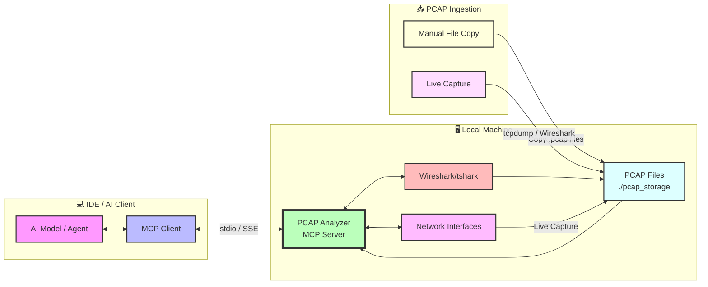
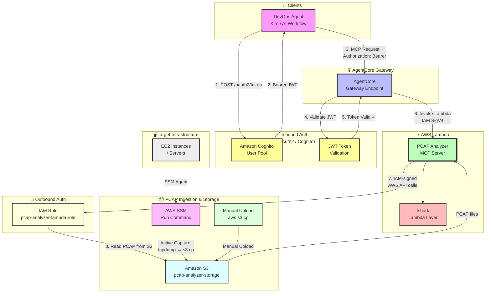
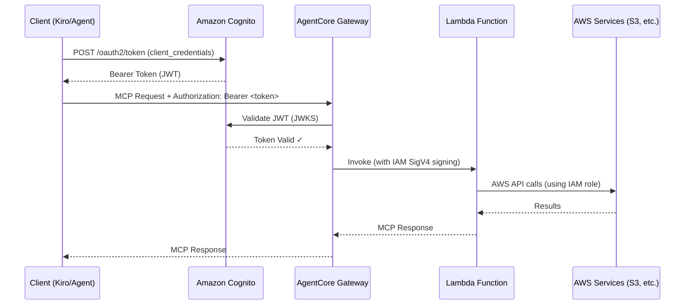

# PCAP Analyzer MCP Server

<div align="center">

[](https://github.com/awslabs/mcp)
[](https://pypi.org/project/awslabs.pcap-analyzer-mcp-server/)
[](LICENSE)

A Model Context Protocol (MCP) server for comprehensive network packet capture and analysis using Wireshark/tshark.

[Installation](#installation) •
[Configuration](#configuration) •
[Tools](#tools) •
[Examples](#usage-examples)

</div>

## Overview

This MCP server enables AI models to perform sophisticated network packet capture and analysis. It provides **31 specialized tools** across 8 categories for deep network analysis, troubleshooting, and security assessment.

### Architecture

There are two primary deployment patterns for this MCP server:

#### Architecture 1: Direct MCP Client on IDE (Local)

Use this when running the server locally alongside your IDE (Claude Desktop, VS Code, Cursor, Kiro, Amazon Q Developer).



#### Architecture 2: DevOps Agent with AgentCore Gateway + Lambda (Cloud)

Use this for team-wide or production deployments where a DevOps agent calls the MCP server through AgentCore Gateway, with full inbound OAuth2/Cognito and outbound IAM authorization.



> **PCAP File Ingestion Options (Cloud Deployment)**:
> - **Manual Upload**: Copy `.pcap` files directly to S3 — `aws s3 cp capture.pcap s3://pcap-analyzer-storage-ACCOUNT_ID/`
> - **SSM Active Troubleshooting**: Use AWS Systems Manager Run Command to capture packets on live EC2 instances and stream results to S3 in real time (see [PCAP Ingestion via SSM](#pcap-ingestion-via-ssm))

### Key Capabilities

- 🔧 Network interface discovery and live packet capture
- 📊 Comprehensive protocol analysis (TCP, TLS, BGP, DNS, HTTP)
- 🔒 Security analysis (TLS handshakes, certificate validation, threat detection)
- ⚡ Performance metrics (latency, throughput, bandwidth, quality)
- 🔍 Protocol-specific troubleshooting and expert analysis

## Prerequisites

- **Python 3.10+**
- **uv** - [Install uv](https://docs.astral.sh/uv/getting-started/installation/)
- **Wireshark/tshark**:
  - macOS: `brew install wireshark`
  - Linux: `sudo apt-get install tshark`  
  - Windows: Download from [wireshark.org](https://www.wireshark.org/download.html)

### Packet Capture Permissions

| Platform | Command |
|----------|---------|
| **macOS** | `sudo dseditgroup -o edit -a $(whoami) -t user access_bpf` (restart required) |
| **Linux** | `sudo setcap cap_net_raw,cap_net_admin=eip /usr/bin/dumpcap` |
| **Windows** | Run as Administrator with Npcap installed |

## 📦 Installation Methods

### Option 1: One-Click Install (Cursor, VS Code)

| Cursor | VS Code |
|:------:|:-------:|
| [](https://cursor.com/en/install-mcp?name=awslabs.pcap-analyzer-mcp-server&config=eyJjb21tYW5kIjoidXZ4IiwiYXJncyI6WyJhd3NsYWJzLnBjYXAtYW5hbHl6ZXItbWNwLXNlcnZlckBsYXRlc3QiXX0=) | [](https://insiders.vscode.dev/redirect/mcp/install?name=PCAP%20Analyzer%20MCP%20Server&config=%7B%22command%22%3A%22uvx%22%2C%22args%22%3A%5B%22awslabs.pcap-analyzer-mcp-server%40latest%22%5D%7D) |

### Option 2: Kiro

**For Kiro users**, add this server at the project level in `.kiro/settings/mcp.json`:

```json
{
  "mcpServers": {
    "pcap-analyzer": {
      "command": "uvx",
      "args": ["awslabs.pcap-analyzer-mcp-server@latest"]
    }
  }
}
```

Visit [kiro.amazon.dev](https://kiro.amazon.dev) for more information.

### Option 3: AgentCore Gateway with Lambda

**For AgentCore users**, this server can be deployed as a Lambda function behind AgentCore Gateway with full inbound (OAuth2/Cognito) and outbound (IAM) authorization.

#### Prerequisites
- AWS account with Lambda, Amazon Cognito, and AgentCore Gateway access
- Kiro configured for your project
- AWS credentials configured (`aws configure` or environment variables)

---

#### Step 1: Create the Lambda Execution Role (IAM)

The Lambda function needs an IAM role with permissions to interact with AgentCore and any AWS services it calls on behalf of users.

```bash
# Create the trust policy
cat > lambda-trust-policy.json << 'EOF'
{
  "Version": "2012-10-17",
  "Statement": [
    {
      "Effect": "Allow",
      "Principal": {
        "Service": "lambda.amazonaws.com"
      },
      "Action": "sts:AssumeRole"
    }
  ]
}
EOF

# Create the IAM role
aws iam create-role \
  --role-name pcap-analyzer-lambda-role \
  --assume-role-policy-document file://lambda-trust-policy.json

# Attach basic Lambda execution permissions
aws iam attach-role-policy \
  --role-name pcap-analyzer-lambda-role \
  --policy-arn arn:aws:iam::aws:policy/service-role/AWSLambdaBasicExecutionRole

# (Optional) Attach S3 access if storing PCAP files in S3
aws iam attach-role-policy \
  --role-name pcap-analyzer-lambda-role \
  --policy-arn arn:aws:iam::aws:policy/AmazonS3FullAccess
```

---

#### Step 2: Create the Lambda Function

```bash
# Package the server for Lambda
zip -r pcap-analyzer-lambda.zip awslabs/ pyproject.toml

# Create Lambda function
aws lambda create-function \
  --function-name pcap-analyzer-mcp-server \
  --runtime python3.10 \
  --role arn:aws:iam::YOUR_ACCOUNT_ID:role/pcap-analyzer-lambda-role \
  --handler awslabs.pcap_analyzer_mcp_server.server.lambda_handler \
  --zip-file fileb://pcap-analyzer-lambda.zip \
  --timeout 300 \
  --memory-size 1024 \
  --environment Variables="{PCAP_STORAGE_DIR=/tmp/pcap_storage,WIRESHARK_PATH=/opt/bin/tshark}"
```

> **Note**: Add `/opt/bin` to `ALLOWED_TSHARK_DIRS` in `server.py` for Lambda deployments where tshark is in a Lambda layer.

---

#### Step 3: Deploy tshark Layer (Required)

Since Lambda doesn't include tshark, you must provide it via a Lambda layer:

```bash
# Create Lambda layer with tshark
mkdir -p layer/bin
# Download static tshark binary or compile for Amazon Linux 2023
cp /path/to/static-tshark layer/bin/tshark
chmod +x layer/bin/tshark

cd layer
zip -r ../tshark-layer.zip .
cd ..

# Publish layer
aws lambda publish-layer-version \
  --layer-name tshark-layer \
  --zip-file fileb://tshark-layer.zip \
  --compatible-runtimes python3.10 python3.11

# Attach layer to the Lambda function
aws lambda update-function-configuration \
  --function-name pcap-analyzer-mcp-server \
  --layers arn:aws:lambda:REGION:YOUR_ACCOUNT_ID:layer:tshark-layer:1
```

---

#### Step 4: Configure Inbound Authorization — OAuth2 via Amazon Cognito

Inbound authorization protects the AgentCore Gateway endpoint so only authenticated users can call MCP tools. This uses **Amazon Cognito User Pool** with OAuth2.

##### 4a. Create a Cognito User Pool

```bash
# Create User Pool
aws cognito-idp create-user-pool \
  --pool-name pcap-analyzer-user-pool \
  --policies '{"PasswordPolicy":{"MinimumLength":8,"RequireUppercase":true,"RequireLowercase":true,"RequireNumbers":true}}' \
  --auto-verified-attributes email \
  --region us-east-1

# Note the UserPoolId from the output, e.g.: us-east-1_XXXXXXXXX
```

##### 4b. Create a Cognito User Pool Client (App Client)

```bash
# Create app client (resource server / M2M client)
aws cognito-idp create-user-pool-client \
  --user-pool-id us-east-1_XXXXXXXXX \
  --client-name pcap-analyzer-gateway-client \
  --explicit-auth-flows ALLOW_USER_PASSWORD_AUTH ALLOW_REFRESH_TOKEN_AUTH \
  --allowed-o-auth-flows client_credentials \
  --allowed-o-auth-scopes pcap-analyzer/read pcap-analyzer/write \
  --generate-secret \
  --region us-east-1

# Note the ClientId and ClientSecret from the output
```

##### 4c. Create a Resource Server (OAuth2 Scope Definition)

```bash
aws cognito-idp create-resource-server \
  --user-pool-id us-east-1_XXXXXXXXX \
  --identifier https://pcap-analyzer.example.com \
  --name "PCAP Analyzer MCP Server" \
  --scopes ScopeName=read,ScopeDescription="Read access" \
            ScopeName=write,ScopeDescription="Write/capture access" \
  --region us-east-1
```

##### 4d. Configure a Cognito Domain

```bash
aws cognito-idp create-user-pool-domain \
  --domain pcap-analyzer-auth \
  --user-pool-id us-east-1_XXXXXXXXX \
  --region us-east-1

# Token endpoint will be:
# https://pcap-analyzer-auth.auth.us-east-1.amazoncognito.com/oauth2/token
```

##### 4e. Configure AgentCore Gateway with Cognito Inbound Auth

Add to your Kiro project's `.kiro/agentcore-gateway.json`:

```json
{
  "mcpServers": {
    "pcap-analyzer": {
      "type": "lambda",
      "functionName": "pcap-analyzer-mcp-server",
      "region": "us-east-1",
      "timeout": 300,
      "inboundAuth": {
        "type": "oauth2",
        "provider": "cognito",
        "userPoolId": "us-east-1_XXXXXXXXX",
        "clientId": "YOUR_COGNITO_CLIENT_ID",
        "tokenEndpoint": "https://pcap-analyzer-auth.auth.us-east-1.amazoncognito.com/oauth2/token",
        "scopes": ["pcap-analyzer/read", "pcap-analyzer/write"],
        "jwksUri": "https://cognito-idp.us-east-1.amazonaws.com/us-east-1_XXXXXXXXX/.well-known/jwks.json"
      }
    }
  }
}
```

##### 4f. Obtain an Access Token (Client Credentials Flow)

Clients must obtain a Bearer token from Cognito before calling the gateway:

```bash
# Get access token using Client Credentials grant
curl -X POST \
  https://pcap-analyzer-auth.auth.us-east-1.amazoncognito.com/oauth2/token \
  -H "Content-Type: application/x-www-form-urlencoded" \
  -d "grant_type=client_credentials" \
  -d "client_id=YOUR_COGNITO_CLIENT_ID" \
  -d "client_secret=YOUR_COGNITO_CLIENT_SECRET" \
  -d "scope=pcap-analyzer/read pcap-analyzer/write"

# Response:
# {
#   "access_token": "eyJraWQ...",
#   "token_type": "Bearer",
#   "expires_in": 3600
# }
```

##### 4g. Call AgentCore Gateway with the Token

```bash
# Use the Bearer token in requests to AgentCore Gateway
curl -X POST https://YOUR_AGENTCORE_GATEWAY_ENDPOINT/mcp \
  -H "Authorization: Bearer eyJraWQ..." \
  -H "Content-Type: application/json" \
  -d '{"method": "tools/list", "params": {}}'
```

> **Token Validation**: AgentCore Gateway automatically validates the JWT against Cognito's JWKS endpoint. Requests with expired, invalid, or missing tokens are rejected with HTTP 401.

---

#### Step 5: Configure Outbound Authorization — IAM

Outbound authorization controls what AWS resources the Lambda function can access when executing on behalf of a user. This uses **IAM roles** to grant least-privilege access.

##### 5a. Create a Scoped IAM Policy for Lambda Outbound Access

```bash
cat > pcap-analyzer-outbound-policy.json << 'EOF'
{
  "Version": "2012-10-17",
  "Statement": [
    {
      "Sid": "AllowS3PcapStorage",
      "Effect": "Allow",
      "Action": [
        "s3:PutObject",
        "s3:GetObject",
        "s3:ListBucket",
        "s3:DeleteObject"
      ],
      "Resource": [
        "arn:aws:s3:::pcap-analyzer-storage-YOUR_ACCOUNT_ID",
        "arn:aws:s3:::pcap-analyzer-storage-YOUR_ACCOUNT_ID/*"
      ]
    },
    {
      "Sid": "AllowCloudWatchLogs",
      "Effect": "Allow",
      "Action": [
        "logs:CreateLogGroup",
        "logs:CreateLogStream",
        "logs:PutLogEvents"
      ],
      "Resource": "arn:aws:logs:*:YOUR_ACCOUNT_ID:log-group:/aws/lambda/pcap-analyzer-*"
    },
    {
      "Sid": "AllowXRayTracing",
      "Effect": "Allow",
      "Action": [
        "xray:PutTraceSegments",
        "xray:PutTelemetryRecords"
      ],
      "Resource": "*"
    }
  ]
}
EOF

# Create and attach the policy
aws iam create-policy \
  --policy-name pcap-analyzer-outbound-policy \
  --policy-document file://pcap-analyzer-outbound-policy.json

aws iam attach-role-policy \
  --role-name pcap-analyzer-lambda-role \
  --policy-arn arn:aws:iam::YOUR_ACCOUNT_ID:policy/pcap-analyzer-outbound-policy
```

##### 5b. Enable IAM Outbound Auth in AgentCore Gateway Configuration

Update `.kiro/agentcore-gateway.json` to include outbound IAM settings:

```json
{
  "mcpServers": {
    "pcap-analyzer": {
      "type": "lambda",
      "functionName": "pcap-analyzer-mcp-server",
      "region": "us-east-1",
      "timeout": 300,
      "inboundAuth": {
        "type": "oauth2",
        "provider": "cognito",
        "userPoolId": "us-east-1_XXXXXXXXX",
        "clientId": "YOUR_COGNITO_CLIENT_ID",
        "tokenEndpoint": "https://pcap-analyzer-auth.auth.us-east-1.amazoncognito.com/oauth2/token",
        "scopes": ["pcap-analyzer/read", "pcap-analyzer/write"],
        "jwksUri": "https://cognito-idp.us-east-1.amazonaws.com/us-east-1_XXXXXXXXX/.well-known/jwks.json"
      },
      "outboundAuth": {
        "type": "iam",
        "roleArn": "arn:aws:iam::YOUR_ACCOUNT_ID:role/pcap-analyzer-lambda-role",
        "sessionName": "AgentCoreGatewaySession",
        "externalId": "YOUR_EXTERNAL_ID_OPTIONAL"
      }
    }
  }
}
```

##### 5c. (Optional) Use IAM Roles Anywhere for Cross-Account or Federated Access

If the Lambda function needs to assume a different role for cross-account access:

```bash
# Update the Lambda role trust policy to allow role chaining
cat > cross-account-trust.json << 'EOF'
{
  "Version": "2012-10-17",
  "Statement": [
    {
      "Effect": "Allow",
      "Principal": {
        "AWS": "arn:aws:iam::YOUR_ACCOUNT_ID:role/pcap-analyzer-lambda-role"
      },
      "Action": "sts:AssumeRole",
      "Condition": {
        "StringEquals": {
          "sts:ExternalId": "YOUR_EXTERNAL_ID"
        }
      }
    }
  ]
}
EOF

# Allow Lambda role to assume target role
cat > allow-assume-role-policy.json << 'EOF'
{
  "Version": "2012-10-17",
  "Statement": [
    {
      "Effect": "Allow",
      "Action": "sts:AssumeRole",
      "Resource": "arn:aws:iam::TARGET_ACCOUNT_ID:role/pcap-analyzer-target-role"
    }
  ]
}
EOF

aws iam put-role-policy \
  --role-name pcap-analyzer-lambda-role \
  --policy-name allow-assume-cross-account \
  --policy-document file://allow-assume-role-policy.json
```

---

#### Step 6: Complete Architecture

With both inbound and outbound authorization configured, the request flow is:



---

#### Step 7: Test the Integration

```bash
# 1. Get Cognito access token
TOKEN=$(curl -s -X POST \
  https://pcap-analyzer-auth.auth.us-east-1.amazoncognito.com/oauth2/token \
  -H "Content-Type: application/x-www-form-urlencoded" \
  -d "grant_type=client_credentials&client_id=YOUR_CLIENT_ID&client_secret=YOUR_SECRET&scope=pcap-analyzer/read" \
  | jq -r '.access_token')

# 2. List available MCP tools via AgentCore Gateway
curl -X POST https://YOUR_AGENTCORE_ENDPOINT/mcp \
  -H "Authorization: Bearer $TOKEN" \
  -H "Content-Type: application/json" \
  -d '{"jsonrpc":"2.0","method":"tools/list","params":{},"id":1}'

# 3. In Kiro, the server is automatically available
# Use tools naturally through your AI agent:
# "Analyze bgp.pcap and explain the BGP connection failure"
```

---

#### Lambda Considerations

| Consideration | Details |
|--------------|---------|
| **Storage** | Lambda has 512MB `/tmp` — suitable for analysis, limited for capture |
| **Timeout** | Set appropriate timeout (max 900s) based on analysis complexity |
| **Memory** | Recommend 1024MB+ for large PCAP files |
| **Capture** | Live packet capture not supported in Lambda (analysis only) |
| **tshark** | Must be provided via Lambda layer (not included in base runtime) |
| **Cold Start** | First invocation may be slower; use Provisioned Concurrency for latency-sensitive use cases |
| **Token Expiry** | Cognito tokens expire in 1 hour by default; implement token refresh in client |

### Option 4: Manual Installation

```bash
# Using uvx (recommended)
uvx awslabs.pcap-analyzer-mcp-server@latest

# Using pip
pip install awslabs.pcap-analyzer-mcp-server
awslabs.pcap-analyzer-mcp-server

# From source
git clone https://github.com/awslabs/mcp.git
cd mcp/src/pcap-analyzer-mcp-server
uv sync
uv run awslabs.pcap-analyzer-mcp-server
```

## Configuration

### Claude Desktop

**macOS**: `~/Library/Application Support/Claude/claude_desktop_config.json`

```json
{
  "mcpServers": {
    "pcap-analyzer": {
      "command": "uvx",
      "args": ["awslabs.pcap-analyzer-mcp-server@latest"]
    }
  }
}
```

**Windows**: `%APPDATA%\Claude\claude_desktop_config.json`

```json
{
  "mcpServers": {
    "pcap-analyzer": {
      "command": "uvx",
      "args": ["awslabs.pcap-analyzer-mcp-server@latest"],
      "env": {
        "WIRESHARK_PATH": "C:\\Program Files\\Wireshark\\tshark.exe"
      },
      "__comment": "You must add 'C:\\Program Files\\Wireshark' to ALLOWED_TSHARK_DIRS in server.py"
    }
  }
}
```

### Amazon Q Developer

Edit `~/.aws/amazonq/mcp.json`:

```json
{
  "mcpServers": {
    "pcap-analyzer": {
      "command": "uvx",
      "args": ["awslabs.pcap-analyzer-mcp-server@latest"]
    }
  }
}
```

### Environment Variables

| Variable | Description | Default |
|----------|-------------|---------|
| `PCAP_STORAGE_DIR` | Directory for storing captured PCAP files | `./pcap_storage` |
| `MAX_CAPTURE_DURATION` | Maximum capture duration in seconds | `3600` |
| `WIRESHARK_PATH` | Path to tshark executable. Must resolve to an allowed directory (see below) | `tshark` |

#### `WIRESHARK_PATH` Security Validation

For security, the tshark executable path is validated at startup against an allowlist of known-safe directories:

- `/usr/bin`
- `/usr/local/bin`
- `/opt/homebrew/bin`
- `/snap/bin`

If your tshark is installed in a different directory (e.g., `/opt/bin` for Lambda layers, or `C:\Program Files\Wireshark\` on Windows), update the `ALLOWED_TSHARK_DIRS` list in `server.py` to include your installation path.

## Tools

This server provides 31 tools organized into 8 categories:

<details>
<summary><b>Network Interface Management (1 tool)</b></summary>

- `list_network_interfaces` - List available network interfaces for packet capture
</details>

<details>
<summary><b>Packet Capture Management (4 tools)</b></summary>

- `start_packet_capture` - Start packet capture on specified interface
- `stop_packet_capture` - Stop an active packet capture session
- `get_capture_status` - Get status of all active capture sessions
- `list_captured_files` - List all captured pcap files in storage directory
</details>

<details>
<summary><b>Basic PCAP Analysis (4 tools)</b></summary>

- `analyze_pcap_file` - Analyze a pcap file and generate insights
- `extract_http_requests` - Extract HTTP requests from pcap file
- `generate_traffic_timeline` - Generate traffic timeline with specified time intervals
- `search_packet_content` - Search for specific patterns in packet content
</details>

<details>
<summary><b>Network Performance Analysis (2 tools)</b></summary>

- `analyze_network_performance` - Analyze network performance metrics from pcap file
- `analyze_network_latency` - Analyze network latency and response times
</details>

<details>
<summary><b>TLS/SSL Security Analysis (6 tools)</b></summary>

- `analyze_tls_handshakes` - Analyze TLS handshakes including SNI, certificate details
- `analyze_sni_mismatches` - Analyze SNI mismatches and correlate with connection resets
- `extract_certificate_details` - Extract SSL certificate details and validate against SNI
- `analyze_tls_alerts` - Analyze TLS alert messages that indicate handshake failures
- `analyze_connection_lifecycle` - Analyze complete connection lifecycle from SYN to FIN/RST
- `extract_tls_cipher_analysis` - Analyze TLS cipher suite negotiations and compatibility issues
</details>

<details>
<summary><b>TCP Protocol Analysis (5 tools)</b></summary>

- `analyze_tcp_retransmissions` - Analyze TCP retransmissions and packet loss patterns
- `analyze_tcp_zero_window` - Analyze TCP zero window conditions and flow control issues
- `analyze_tcp_window_scaling` - Analyze TCP window scaling and flow control mechanisms
- `analyze_packet_timing_issues` - Analyze packet timing issues and duplicate packets
- `analyze_congestion_indicators` - Analyze network congestion indicators and quality metrics
</details>

<details>
<summary><b>Advanced Network Analysis (5 tools)</b></summary>

- `analyze_dns_resolution_issues` - Analyze DNS resolution issues and query patterns
- `analyze_expert_information` - Analyze Wireshark expert information for network issues
- `analyze_protocol_anomalies` - Analyze protocol anomalies and malformed packets
- `analyze_network_topology` - Analyze network topology and routing information
- `analyze_security_threats` - Analyze potential security threats and suspicious activities
</details>

<details>
<summary><b>Performance & Quality Metrics (4 tools)</b></summary>

- `generate_throughput_io_graph` - Generate throughput I/O graph data with specified time intervals
- `analyze_bandwidth_utilization` - Analyze bandwidth utilization and traffic patterns
- `analyze_application_response_times` - Analyze application layer response times and performance
- `analyze_network_quality_metrics` - Analyze network quality metrics including jitter and packet loss
</details>

## Usage Examples

### Example 1: Analyze BGP Connection Issues
```
"Analyze bgp.pcap and explain why the BGP connection is failing"
```

The server examines BGP OPEN messages, AS numbers, connection lifecycle, and identifies configuration mismatches.

### Example 2: Live Packet Capture
```
"Capture network traffic on eth0 for 60 seconds and analyze for security threats"
```

### Example 3: TLS Troubleshooting
```
"Examine TLS handshakes in https-traffic.pcap and identify any certificate issues"
```

### Example 4: TCP Performance Analysis
```
"Check for TCP retransmissions and analyze connection quality in the packet capture"
```

### Example 5: Comprehensive Analysis
```
"Give me a complete analysis of all protocols and traffic patterns in network-dump.pcap"
```

## Troubleshooting

<details>
<summary><b>tshark not found</b></summary>

```bash
# Verify installation
tshark --version

# Check where tshark is installed
which tshark

# Install if missing
brew install wireshark              # macOS
sudo apt-get install tshark         # Linux
# Windows: Download from wireshark.org and add to PATH
```

If tshark is installed but you see `tshark path ... is not in allowed directories`, add your tshark's parent directory to the `ALLOWED_TSHARK_DIRS` list in `server.py`.
</details>

<details>
<summary><b>Permission denied</b></summary>

**macOS**: `sudo dseditgroup -o edit -a $(whoami) -t user access_bpf` (restart required)

**Linux**: `sudo setcap cap_net_raw,cap_net_admin=eip /usr/bin/dumpcap`

**Windows**: Run as Administrator
</details>

<details>
<summary><b>PCAP file not found</b></summary>

- List files with `list_captured_files`
- Use relative path: `bgp.pcap`
- Or absolute path: `/full/path/file.pcap`
- Verify `.pcap` extension
</details>

<details>
<summary><b>Analysis returns empty results</b></summary>

- PCAP may not contain the analyzed protocol
- Display filter may be too restrictive
- Run basic analysis first: `analyze_pcap_file`
</details>

## PCAP Ingestion via SSM

When using the **cloud deployment** (AgentCore Gateway + Lambda), you need to get PCAP files into S3 so the Lambda function can analyze them. There are two approaches:

### Option A: Manual Upload to S3

Upload `.pcap` files you already have to the S3 bucket:

```bash
# Create the S3 bucket (one-time setup)
aws s3 mb s3://pcap-analyzer-storage-YOUR_ACCOUNT_ID --region us-east-1

# Upload a single PCAP file
aws s3 cp capture.pcap s3://pcap-analyzer-storage-YOUR_ACCOUNT_ID/captures/

# Upload all PCAP files from a directory
aws s3 cp ./pcap_files/ s3://pcap-analyzer-storage-YOUR_ACCOUNT_ID/captures/ --recursive --include "*.pcap"

# Verify upload
aws s3 ls s3://pcap-analyzer-storage-YOUR_ACCOUNT_ID/captures/
```

This approach is ideal when:
- You already have `.pcap` files captured offline (e.g., from Wireshark, tcpdump, or network appliances)
- You are doing post-incident forensic analysis
- You have existing packet captures from other tools you want to analyze

---

### Option B: Active Troubleshooting via AWS SSM Run Command

Use **AWS Systems Manager (SSM) Run Command** to remotely capture packets on live EC2 instances and automatically upload them to S3 — without needing SSH access or open inbound ports.

#### Prerequisites for SSM Capture

1. The EC2 instance must have the **SSM Agent** installed and running (pre-installed on Amazon Linux 2, Amazon Linux 2023, and recent Ubuntu/Windows AMIs)
2. The EC2 instance's IAM role must have `AmazonSSMManagedInstanceCore` permissions
3. The IAM role must also allow `s3:PutObject` on the PCAP storage bucket

```bash
# Verify SSM connectivity
aws ssm describe-instance-information \
  --filters Key=InstanceIds,Values=i-XXXXXXXXXXXXXXXXX

# Attach SSM policy to instance role (if not already attached)
aws iam attach-role-policy \
  --role-name YOUR_EC2_INSTANCE_ROLE \
  --policy-arn arn:aws:iam::aws:policy/AmazonSSMManagedInstanceCore
```

#### Capture Packets on a Remote EC2 Instance via SSM

```bash
# Run tcpdump on EC2 instance for 60 seconds and upload to S3
aws ssm send-command \
  --instance-ids "i-XXXXXXXXXXXXXXXXX" \
  --document-name "AWS-RunShellScript" \
  --parameters '{"commands":[
    "CAPTURE_FILE=/tmp/capture-$(date +%Y%m%d-%H%M%S).pcap",
    "S3_BUCKET=pcap-analyzer-storage-YOUR_ACCOUNT_ID",
    "timeout 60 tcpdump -i any -w $CAPTURE_FILE -s 0 2>/dev/null || true",
    "aws s3 cp $CAPTURE_FILE s3://$S3_BUCKET/captures/ --region us-east-1",
    "echo Upload complete: $CAPTURE_FILE",
    "rm -f $CAPTURE_FILE"
  ]}' \
  --comment "PCAP capture for network troubleshooting" \
  --region us-east-1

# Note the CommandId from the output
```

#### Capture with a Specific Filter (e.g., TCP port 443 only)

```bash
aws ssm send-command \
  --instance-ids "i-XXXXXXXXXXXXXXXXX" \
  --document-name "AWS-RunShellScript" \
  --parameters '{"commands":[
    "CAPTURE_FILE=/tmp/capture-tls-$(date +%Y%m%d-%H%M%S).pcap",
    "S3_BUCKET=pcap-analyzer-storage-YOUR_ACCOUNT_ID",
    "timeout 120 tcpdump -i eth0 -w $CAPTURE_FILE -s 0 tcp port 443 2>/dev/null || true",
    "aws s3 cp $CAPTURE_FILE s3://$S3_BUCKET/captures/tls/ --region us-east-1",
    "rm -f $CAPTURE_FILE"
  ]}' \
  --region us-east-1
```

#### Check Command Status

```bash
# Check if the capture command completed
aws ssm get-command-invocation \
  --command-id "COMMAND_ID_FROM_ABOVE" \
  --instance-id "i-XXXXXXXXXXXXXXXXX" \
  --region us-east-1
```

#### List Captured Files in S3

```bash
# List all captured files
aws s3 ls s3://pcap-analyzer-storage-YOUR_ACCOUNT_ID/captures/ --recursive

# Get the most recent capture
aws s3 ls s3://pcap-analyzer-storage-YOUR_ACCOUNT_ID/captures/ \
  --recursive | sort | tail -5
```

#### Tell the MCP Agent to Analyze the Capture

Once the capture is in S3, instruct your DevOps agent:

```
"Download s3://pcap-analyzer-storage-YOUR_ACCOUNT_ID/captures/capture-20240226-143022.pcap 
 and analyze it for TLS handshake failures"
```

#### IAM Permissions Required for SSM Capture

The EC2 instance's IAM role needs:

```json
{
  "Version": "2012-10-17",
  "Statement": [
    {
      "Effect": "Allow",
      "Action": [
        "s3:PutObject",
        "s3:PutObjectAcl"
      ],
      "Resource": "arn:aws:s3:::pcap-analyzer-storage-YOUR_ACCOUNT_ID/captures/*"
    }
  ]
}
```

#### Comparison: Manual Upload vs SSM

| | Manual Upload | SSM Run Command |
|---|---|---|
| **Use case** | Existing captures, offline analysis | Live troubleshooting, no SSH needed |
| **Access required** | AWS CLI / Console | SSM Agent on instance |
| **Inbound ports** | None | None (SSM uses outbound HTTPS) |
| **Real-time** | No | Yes (captures live traffic) |
| **Automation** | Script with `aws s3 cp` | `aws ssm send-command` |
| **Cost** | S3 storage only | S3 + SSM API calls (free tier available) |

---

## Development

```bash
# Clone repository
git clone https://github.com/awslabs/mcp.git
cd mcp/src/pcap-analyzer-mcp-server

# Install dependencies
uv sync

# Run server
uv run awslabs.pcap-analyzer-mcp-server

# Run tests
uv run pytest
```

## Contributing

This server is part of the [AWS Labs MCP project](https://github.com/awslabs/mcp). Contributions welcome!

## License

Apache License 2.0 - see [LICENSE](LICENSE) file.

Copyright 2024 Amazon.com, Inc. or its affiliates. All Rights Reserved.

---

<div align="center">

**Part of [AWS Labs MCP Servers](https://github.com/awslabs/mcp)**

[Documentation](https://awslabs.github.io/mcp/servers/pcap-analyzer-mcp-server/) •
[Report Bug](https://github.com/awslabs/mcp/issues) •
[Request Feature](https://github.com/awslabs/mcp/discussions)

</div>
